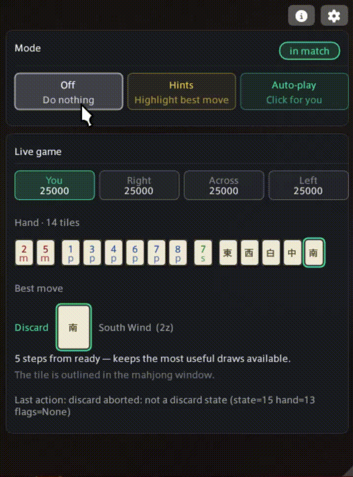

<p align="center">
  
</p>

<h1 align="center">Doman Mahjong Solver</h1>

<p align="center">
  <a href="https://github.com/XeldarAlz/FFXIV-DomanMahjongSolver/releases/latest"></a>
  <a href="https://github.com/XeldarAlz/FFXIV-DomanMahjongSolver/releases"></a>
  <a href="https://github.com/XeldarAlz/FFXIV-DomanMahjongSolver/actions/workflows/ci.yml"></a>
  <a href="LICENSE.md"></a>
</p>

<p align="center">
  <em>Doman Mahjong, solved for you. Built on Dalamud.</em>
</p>

---

<p align="center">
  
</p>

## What it does

Sit at a mahjong table and a small window watches your hand, suggesting the best discard and why. Three modes:

- **Off**: plugin sleeps.
- **Hints**: shows the best discard + top alternatives with reasoning. You click every move. *100% safe.*
- **Auto-play**: plays for you with natural pacing.

## Features

- Three modes: Off / Hints / Auto-play, one click each.
- Hand, score, and discard-count readout from addon memory.
- Top-3 discard candidates with short reasoning.
- Full call handling: Pon · Chi · Kan · Riichi · Tsumo · Ron.
- Akadora-aware scoring; meld inference for chi/pon/minkan races.
- Adjustable "thinking" delay so auto-play looks human.
- Per-dispatch chat-log annotations make regressions a single log paste away.

## Install

In-game: `/xlsettings` → **Experimental** → paste into **Custom Plugin Repositories**:

```
https://raw.githubusercontent.com/XeldarAlz/DalamudPlugins/main/repo.json
```

Tick **Enabled**, click **+**, then **Save and Close**. Open `/xlplugins` → **All Plugins**, search for **Doman Mahjong Solver**, and install.

## Commands

| Command | Action |
|---|---|
| `/mjauto` | Toggle the main window |
| `/mjauto pass <N>` | Click button index `<N>` on a call prompt (0 = leftmost) |
| `/mjauto capture <label>` | Capture the next dispatch payload to disk (debugging) |
| `/mjauto variant dump` | Dump client variant info (JP / OC verification) |

## Client compatibility

The mahjong addon ships under different names and memory layouts per region. EU is the reference variant; NA has the same texture base + offsets but hasn't been re-verified against v0.1.0.11. JP and OC need verification dumps.

| Feature | EU (`Emj`) | NA (`EmjL`) | JP | OC |
|---|---|---|---|---|
| Window detection | Yes | Yes | Untested | Untested |
| Hand / score reading | Yes | Needs re-verification ([#30](https://github.com/XeldarAlz/FFXIV-DomanMahjongSolver/issues/30)) | Untested | Untested |
| Discard (state-30 in-hand) | Yes | Probably yes | Untested | Untested |
| Discard (state-6 self-declare popup) | Yes | Probably yes | Untested | Untested |
| Post-call discard popup | Yes | Probably yes | Untested | Untested |
| Pon / Chi / Kan acceptance | Yes | Likely yes ([#30](https://github.com/XeldarAlz/FFXIV-DomanMahjongSolver/issues/30)) | Untested | Untested |
| Riichi / Tsumo / Ron commit | Yes (v0.1.0.11) | Untested | Untested | Untested |

If you're on JP or OC: seat at a Doman table, run `/mjauto variant dump`, and attach the file to a new issue.

## Troubleshooting

**Misclicked a call prompt?** Click the right option yourself in-game: the plugin resumes on the next turn. Or from chat: `/mjauto pass <N>`.

**Plugin stalled on a popup?** Switch to **Off**, click manually, then re-enable **Auto-play**. If you can reproduce, run `/mjauto capture <label>` first: the `FireCallback` payload lands in `pluginConfigs/Mahjong.Plugin.Dalamud/emj-captures.log` and is the fastest way to get a fix shipped.

Known edge cases that can stall the bot (manual click resumes play): post-MinKan transient, two consecutive Pon offers within ~1 second.

## License

AGPL-3.0-or-later. See [LICENSE.md](LICENSE.md).
